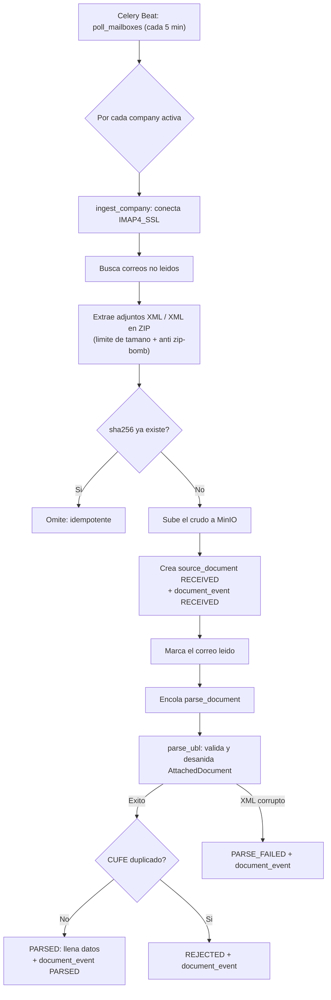

# contaflow

Capa de automatizacion contable sobre **Odoo** para firmas contables colombianas.
Captura la factura electronica (XML UBL 2.1 de la DIAN), la guarda, la parsea y —en
fases posteriores— la clasifica y propone asientos en Odoo. No es un ERP ni un motor
contable nuevo: es la capa de automatizacion que se monta sobre Odoo.

Ver [CLAUDE.md](CLAUDE.md) para el contexto regulatorio, el stack y las reglas no
negociables. Alcance diferido y limitaciones conocidas en [PENDIENTES.md](PENDIENTES.md).

---

## Requisitos

- **Docker** + Docker Compose (levanta todo el stack).
- **uv** (opcional) solo para correr los tests de integracion en el host, que usan
  `testcontainers` y necesitan hablar con el Docker del host.

---

## Levantar el entorno desde cero

1. Copia la plantilla de variables y crea tu `.env`:

   ```bash
   cp .env.example .env
   ```

2. Genera una clave de cifrado (Fernet) real y ponla en `FERNET_KEY` dentro de `.env`:

   ```bash
   python -c "from cryptography.fernet import Fernet; print(Fernet.generate_key().decode())"
   ```

3. Levanta el stack (construye imagenes la primera vez):

   ```bash
   docker compose up -d --build
   ```

4. Aplica las migraciones de base de datos:

   ```bash
   docker compose run --rm api alembic upgrade head
   ```

5. Verifica que todo responde (conectividad real con Postgres, Redis y MinIO):

   ```bash
   curl http://localhost:8000/health
   ```

   Debe devolver `{"status":"ok","services":{"postgres":"up","redis":"up","minio":"up"}}`.

### Servicios y puertos

| Servicio | URL / puerto | Para que |
|---|---|---|
| API (FastAPI) | http://localhost:8000 · docs en `/docs` | endpoints y salud |
| MinIO (consola) | http://localhost:9001 | ver el XML/PDF crudo almacenado |
| Odoo | http://localhost:8069 | motor contable (aun sin `l10n_co`) |
| PostgreSQL (nuestra) | localhost:5432 | base propia |
| Redis, worker, beat | interno | cola y tareas asincronas |

---

## Cargar una factura de prueba

Sin configurar un buzon IMAP, puedes ejercitar el pipeline real (MinIO + base + parser)
contra una empresa demo con el cargador incluido:

```bash
docker compose run --rm api python -m contaflow.scripts.cargar_factura tests/fixtures/xml/factura_simple.xml
```

Imprime el `id`, el estado resultante (`PARSED`), el CUFE, el NIT del emisor y el total.
Es idempotente: si corres el mismo XML dos veces, no se duplica.

En produccion la ingesta no es manual: Celery Beat recorre cada 5 minutos los buzones
IMAP de las empresas activas (ver el flujo abajo).

---

## Flujo de ingesta



Garantias clave del flujo:

- **Idempotencia doble:** `sha256` del crudo (pre-parseo) y `CUFE` unico (final).
- **El crudo se guarda siempre** antes de parsear (evidencia ante la DIAN).
- **Trazabilidad append-only:** cada transicion queda en `document_event` (tabla que un
  trigger de PostgreSQL protege contra `UPDATE`/`DELETE`).
- **El correo se marca leido solo despues de persistir** su contenido.

---

## Tests, lint y tipos

```bash
# Unitarios (parser, extraccion de adjuntos, health) — en contenedor, sin infra:
docker compose run --rm --no-deps api uv run pytest tests/unit -q

# Lint + formato + tipos:
docker compose run --rm --no-deps api uv run ruff check .
docker compose run --rm --no-deps api uv run mypy

# Integracion (modelo + pipeline) — en el host, usa testcontainers:
uv run --python 3.12 pytest tests/integration -q
```

Tambien hay atajos en el [Makefile](Makefile): `make up`, `make down`, `make test`,
`make test-int`, `make lint`, `make migrate`.

---

## Operacion y seguridad

- **Autenticacion:** la API usa JWT (access + refresh); las contrasenas se guardan con
  argon2. Crea usuarios con `python -m contaflow.scripts.crear_usuario`.
- **Multi-tenant:** cada endpoint filtra por el tenant del usuario; hay un test de
  aislamiento que lo verifica.
- **Secretos cifrados en reposo:** credenciales de Odoo/IMAP con Fernet.
  **Rotacion de clave:** pon la clave nueva en `FERNET_KEY`, mueve la anterior a
  `FERNET_KEYS_SECONDARY` (lista separada por coma). Lo nuevo se cifra con la nueva y
  lo viejo se sigue descifrando; cuando ya no queden datos con la vieja, quitala.
- **Observabilidad:** logs JSON con `request_id` por request; `/metrics` (Prometheus)
  protegido por `METRICS_TOKEN` si se define (vacio = abierto, solo para dev); Sentry se
  activa solo si defines `SENTRY_DSN`.
- **IMAP:** conexion `IMAP4_SSL` con verificacion de certificado y hostname.
- **Backups (produccion):** respaldar el volumen de PostgreSQL (`pg_dump` o snapshot del
  volumen `contaflow_pgdata`) y el bucket de MinIO (`mc mirror`). No automatizado aun.
- **CI/CD:** fuera de alcance por ahora segun `CLAUDE.md`; correr los tests localmente.

---

## Estado del proyecto

**Sprint 1 completo** (ingesta): andamiaje ejecutable, modelo de datos + migraciones,
parser UBL 2.1 y lector IMAP + pipeline de ingesta.

Fragilidades y alcance diferido (detalle en [PENDIENTES.md](PENDIENTES.md)):

- **Firma XAdES-EPES sin validar:** el CUFE da idempotencia, no autenticidad. Un XML
  falsificado pero bien formado hoy pasaria el parseo. Es el pendiente #1.
- **Fixtures UBL sinteticos:** reconstruidos segun el estandar DIAN; faltan validar
  contra facturas reales (schemeName del CUFE, codigos de Documento Soporte,
  Retefuente/ReteIVA/ReteICA).
- **Sin dead-letter formal:** hay reintentos con backoff, pero la cola de fallidos real
  esta pendiente.
- **Odoo sin `l10n_co`:** levanta, pero el modulo contable colombiano hay que montarlo
  en `odoo/addons/` cuando lleguemos a la fase de posting.

---

## Aviso legal

La informacion procesada por contaflow **no reemplaza asesoria contable profesional**.
La responsabilidad profesional es del contador publico.
```
